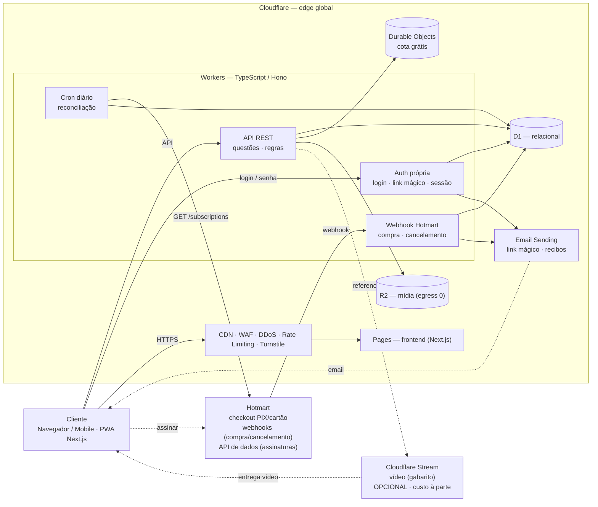
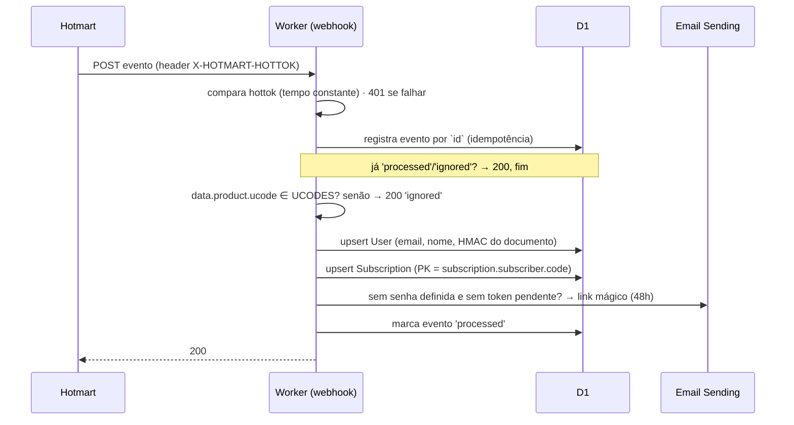
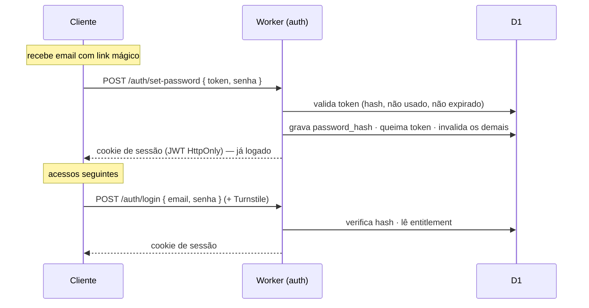
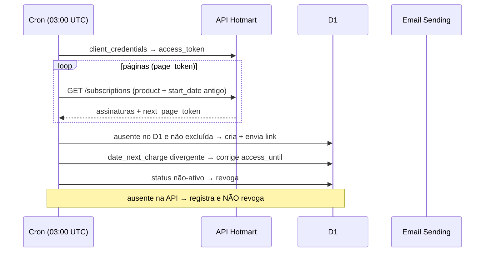
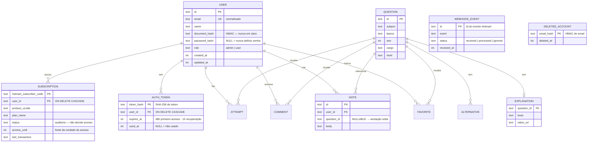

# Mais Aprovação — Especificação Técnica (MVP)

> Documento técnico de referência para construção. Companion da proposta comercial (`proposta-mais-aprovacao.pdf`). Prazo do MVP: **3 meses**. Custos verificados em jun/2026.
>
> **Revisão de jul/2026 — mudança de premissa.** A versão anterior deste documento assumia login via **Hotmart OAuth 2.0**. Essa premissa estava errada: a Hotmart não oferece OAuth de identidade para login de terceiros — expõe apenas webhooks e uma API de dados server-to-server. A plataforma passa a ter **autenticação própria**, com contas criadas pelo webhook de compra. As seções 1 a 5, 8 e 9 foram reescritas.

---

## 1. Decisões de arquitetura (resumo)

| Camada | Escolha | Porquê |
|---|---|---|
| Compute | **Cloudflare Workers** (TypeScript + **Hono**) | Edge global, escala automática, custo ~zero no volume |
| Frontend | **Cloudflare Pages** (Next.js) | Responsivo, SSR/SEO, banda grátis e ilimitada |
| Banco | **D1** (SQLite serverless) | Relacional, dentro da franquia do Workers Paid |
| Cache / sessão | **KV** *(adiado)* | Entra como cache de leitura das questões no sub-projeto 3 |
| Estado/cota | **Durable Objects** (1 por usuário) | Contador da cota grátis, single-writer por usuário |
| Mídia | **R2** (egress zero) | Imagens/estáticos sem custo de banda |
| Vídeo | **Cloudflare Stream** *(isolado)* | Streaming adaptativo; **único custo que escala com uso** |
| Identidade | **Autenticação própria** (email + senha, link mágico) | A Hotmart não oferece OAuth de login |
| Provisionamento | **Webhook Hotmart** (`PURCHASE_APPROVED`) | A compra é o que cria a conta — não há autocadastro |
| Email transacional | **Cloudflare Email Sending** (binding `send_email`) | 3.000/mês na franquia do Workers Paid; zero dependência externa |
| Assinatura | **Webhook + API de dados Hotmart** | Cobrança/recorrência fora do app; cron diário reconcilia |
| Segurança borda | WAF · DDoS · Rate Limiting · **Turnstile** | Anti-bot e proteção na borda, nativos |

---

## 2. Diagrama macro

Não há seta de login entre o Worker e a Hotmart. A Hotmart entra por três caminhos independentes: **checkout** (o aluno vai até lá comprar), **webhooks** (ela nos avisa) e **API de dados** (nós consultamos, no cron).

---

## 3. Fluxos

### 3.1 Provisionamento — o webhook de compra cria a conta

Endpoint único `POST /webhooks/hotmart` recebe todos os eventos configurados.

A ordem é deliberada: o evento só é marcado `processed` no **fim**. Se o envio do email falhar, o Worker responde 5xx, a Hotmart reenvia e o fluxo reprocessa. Marcar no início transformaria uma falha de email em aluno pagante sem acesso e sem retentativa.

**Mapa de eventos:**

| Evento | Efeito |
|---|---|
| `PURCHASE_APPROVED` | ativa/renova · `access_until = purchase.date_next_charge` · email só se `password_hash IS NULL`, sem token pendente e `recurrence_number == 1` |
| `PURCHASE_REFUNDED` · `PURCHASE_CHARGEBACK` · `PURCHASE_PROTEST` | revoga: `access_until = now` |
| `PURCHASE_DELAYED` | `status='DELAYED'`, **preserva** `access_until` → carência natural até o fim do ciclo pago |
| `PURCHASE_CANCELED` · `PURCHASE_EXPIRED` | boleto/Pix não pago; `status='EXPIRED'` se a linha existir |
| `PURCHASE_COMPLETE` | apenas registra (fim do prazo de garantia). Sem efeito no acesso |
| `SUBSCRIPTION_CANCELLATION` | busca por `data.subscriber.code` · `access_until = data.date_next_charge` (ou `now` se ausente/passado) |

**Por que `PURCHASE_APPROVED` e não `PURCHASE_COMPLETE`:** `APPROVED` dispara na aprovação do pagamento e em cada renovação. `COMPLETE` dispara só ao encerrar o prazo de garantia (7 a 30 dias) — usá-lo faria o aluno pagar e esperar semanas pelo acesso.

**Cancelamento não filtra por ucode.** O payload de `SUBSCRIPTION_CANCELLATION` não traz `product.ucode` (só `product.id` e `product.name`). O casamento é pela PK `subscriber_code`; código desconhecido → `200 ignored`.

**Se `date_next_charge` vier ausente**, `access_until` recebe `now + 7 dias` — curto de propósito, já que a periodicidade do plano não vem no payload de compra. O cron corrige com o valor real na primeira execução. O erro possível é acesso de menos por até 24h a quem pagou, nunca acesso indefinido a quem não pagou.

### 3.2 Primeiro acesso e login

O link do email aponta para o frontend (`{APP_BASE_URL}/definir-senha?token=…`), que chama a API. Erros de login são **sempre genéricos** (`email ou senha inválidos`), inclusive quando o usuário existe mas nunca definiu senha — para não revelar existência de conta.

**Não existe autocadastro.** Nenhuma rota de registro. A tela de login exibe um link para o checkout da Hotmart.

### 3.3 Recuperação de acesso

`POST /auth/recover { email, documento }` → se os dados casarem, gera token (TTL 1h) e envia o link. A resposta é **sempre 200 genérica**, independente do resultado: *"Se os dados estiverem corretos, enviamos as instruções para o email cadastrado."*

O documento (CPF) vem do evento de compra (`data.buyer.document`). Ele não adiciona segredo — o link vai para o email cadastrado de qualquer forma — mas serve como **anti-spam**, impedindo disparar emails de recuperação para terceiros. Se o checkout não tiver capturado o documento, a validação recai só sobre o email, para não trancar cliente pagante fora.

Proteções: Turnstile, rate limit na borda, **cooldown de 5 min** por usuário e **guarda de token pendente**.

### 3.4 Revogação de acesso

O acesso é decidido por **uma única comparação de data**: `access_until > now`. Toda revogação — reembolso, chargeback, cancelamento, atraso — se resume a escrever nessa coluna. O `status` da assinatura é auditoria, nunca entra na decisão de autorização.

No cancelamento, `access_until` recebe `date_next_charge`: como a própria documentação da Hotmart determina, quem cancela no dia 20 de um ciclo cobrado no dia 10 mantém acesso até o dia 10 seguinte.

### 3.5 Reconciliação diária (cron)

O cron fecha os dois furos que o webhook deixa quando uma entrega falha: **compra perdida** (aluno pagou e não existe no sistema — único remédio automático, porque o próprio recover não ajuda quem não existe) e **cancelamento perdido** (ex-assinante mantendo acesso pago).

**Duas regras não-negociáveis**, ambas derivadas da documentação do endpoint:

1. **`start_date` explícito e antigo.** O default da API é *hoje − 30 dias* sobre a data de início da assinatura. Sem passar o parâmetro, toda assinatura veterana parece inexistente.
2. **Ausência nunca revoga.** Só revoga com retorno explícito de status não-ativo ou `date_next_charge` no passado. Um filtro errado ou uma página que falhe no meio revogaria a base inteira.

Diário, não mensal: o caso que dói é *"paguei e não recebi acesso"*, que é ticket de suporte em horas. Cron Triggers não têm custo adicional e 1.500 assinaturas são ~30 páginas de API por execução.

### 3.6 Exclusão de conta (LGPD)

`DELETE /auth/me` — exige sessão válida **e a senha atual** no corpo (reautenticação para ação destrutiva).

A exclusão **cancela as assinaturas do aluno na Hotmart** antes de apagar a conta, via `POST /subscriptions/{subscriber_code}/cancel`, com a flag de notificação ligada — a confirmação de que a cobrança parou deve vir de quem cobra.

**A ordem é cancelar e depois apagar, nunca o contrário.** Se apagássemos primeiro e o cancelamento falhasse, o aluno ficaria pagando por uma conta que não existe mais, e sem nenhum registro nosso do `subscriber_code` para consertar. Cancelando primeiro, uma falha apenas aborta a exclusão com mensagem clara — o titular tenta de novo, e nada foi perdido.

| Resposta do cancelamento | Tratamento |
|---|---|
| 200 | segue para a exclusão |
| 400 (já cancelada) | idempotente do nosso ponto de vista → segue |
| 404 (código desconhecido) | não há cobrança que possamos parar → registra e segue |
| 5xx / rede | **aborta a exclusão** e devolve erro ao titular |

Com 1:N, todas as assinaturas do usuário são canceladas antes do `DELETE`.

O cancelamento **notifica o webhook de volta** (a própria documentação diz que o endpoint "notifica o cancelamento para sub-sistemas como Club e Webhook"). Chega então um `SUBSCRIPTION_CANCELLATION` com um `subscriber_code` que a cascata já apagou — e o handler o trata como código desconhecido, `ignored`. O laço se fecha sem efeito colateral.

**O problema que a exclusão ingênua ainda cria:** o cancelamento não elimina a necessidade da tombstone. Assinatura cancelada tem `date_next_charge` no futuro (é a data do último acesso pago), então o cron da madrugada seguinte ainda a veria na API, ausente no D1, e recriaria a conta com email de boas-vindas.

Por isso a exclusão grava uma **tombstone** (`deleted_accounts`: HMAC do email + data, sem nenhum dado legível):

| Situação | Comportamento |
|---|---|
| Renovação (`recurrence_number > 1`) com email na tombstone | `ignored` — não recria, não envia email |
| Cron encontra assinatura ativa com email na tombstone | pula |
| **Nova** compra (`recurrence_number == 1`) com email na tombstone | limpa a tombstone e provisiona como cliente novo |

A última linha impede que a tombstone se torne banimento perpétuo.

**Consequência que aparece na tela de confirmação e no recibo por email:** excluir a conta **cancela a assinatura e interrompe as cobranças**, e o acesso termina na hora — inclusive os dias já pagos do ciclo corrente, que são perdidos. Para voltar é preciso assinar novamente (o recover não ressuscita conta excluída; se ressuscitasse, qualquer um com email e CPF desfaria a exclusão).

Optamos por não postergar a exclusão até o fim do período pago: atrasar o atendimento de um pedido de exclusão em até um mês é pior, sob a LGPD, do que perder dias de acesso — e o titular decide com a informação na tela.

**Invariante de segurança:** só a exclusão iniciada pelo titular chama o cancelamento. O cron **nunca** cancela nada — um bug na reconciliação que chamasse esse endpoint destruiria a receita do negócio em uma execução. Por isso a chamada de escrita vive num módulo separado do cliente de leitura que o cron usa (seção 5).

Comentários públicos têm autoria anonimizada (`ON DELETE SET NULL` → "usuário removido") em vez de apagados: atende o essencial da LGPD, que é remover a identificação, sem abrir buracos em discussões que outros alunos leem e respondem.

---

## 4. Modelo de dados (D1)

Quatro decisões estruturais:

**`access_until` é o único predicado de acesso.** `tier = 'assinante'` se existir qualquer assinatura do usuário com `access_until > now`. Uma comparação de data cobre assinatura ativa, cancelada com ciclo pago em curso, atrasada em carência e revogada — sem máquina de estados na camada de autorização.

**`SUBSCRIPTION` é 1:N por usuário**, com PK em `hotmart_subscriber_code`. Isso casa exatamente com o evento de cancelamento, que só traz `subscriber.code`: busca direta pela chave primária. Um aluno que troque de plano tem duas linhas, e o cancelamento da antiga não afeta a nova.

**Não há `hotmart_user_id`.** Sem OAuth não existe identidade Hotmart para referenciar. A ligação é `email` (pessoa) e `subscriber_code` (assinatura).

**Toda FK para `USER` declara ação de exclusão** desde a primeira migração — `CASCADE` para dados estritamente pessoais, `SET NULL` para autoria de conteúdo público. Com a convenção estabelecida no dia 1, a exclusão de conta é um único `DELETE FROM users` e cada tabela criada depois entra na cascata automaticamente. O D1 aplica foreign keys por padrão (equivalente a `PRAGMA foreign_keys = on`) e suporta essas ações.

`UsageQuota` não fica em tabela: vive num **Durable Object por usuário** (contador + janela), mecanismo da cota grátis e do rate-limit por usuário. `EXPLANATION.video_url` aponta para o Cloudflare Stream — manter só a URL desacopla o vídeo do resto.

---

## 5. Segurança

### Webhook — superfície pública hostil

- **`X-HOTMART-HOTTOK`** comparado em tempo constante; 401 sem match.
- **Validação tolerante (Zod):** valida só os campos que usamos e ignora o resto — a Hotmart adiciona campos sem aviso.
- **Idempotência** pelo `id` do evento; só `processed`/`ignored` deduplicam.
- **Nunca concede `role='admin'`.** O papel vem exclusivamente da allowlist `ADMIN_EMAILS`; payload forjado não escala privilégio.

### Autenticação

- **Senha:** PBKDF2-HMAC-SHA256, 100k iterações, salt de 16 bytes, via WebCrypto nativo (sem dependência). Armazenada como `pbkdf2$sha256$100000$<salt>$<hash>`, com os parâmetros embutidos para elevar o custo depois sem migração. Não é bcrypt/argon2 porque Workers não tem nenhum dos dois nativo — seria WASM e bundle. Mínimo de 8 caracteres, sem regras de composição (recomendação NIST atual).
- **Link mágico:** 32 bytes de `crypto.getRandomValues`, armazenado como SHA-256, **uso único**, e ao ser consumido invalida os demais tokens do usuário.
- **Respostas genéricas** em login e recuperação — não vazam existência de conta nem validade de documento.
- **Turnstile server-side** (`siteverify` no Worker) em login e recuperação. Não em `set-password`: o token já tem 256 bits de entropia, captcha ali é fricção sem ganho.
- **Cooldown** de 5 min na recuperação e guarda de token pendente, contra email-bombing.
- **Rate limit na borda** (Rate Limiting Rules) em `/auth/*` e `/webhooks/hotmart` — configuração, não código.

### Sessão

JWT HS256 em cookie **HttpOnly / Secure / SameSite=Lax**, expiração de 7 dias, carregando apenas `sub` (id do usuário). O **entitlement é sempre relido do D1** a cada request protegido — por isso um chargeback revoga acesso na hora, sem esperar o token expirar. É exatamente o motivo de o JWT não carregar `role` nem `tier`.

### Segredos

Em **Workers Secrets**, nunca em código: `JWT_SECRET`, `HOTMART_HOTTOK`, `HOTMART_CLIENT_ID`, `HOTMART_CLIENT_SECRET`, `DOCUMENT_HMAC_KEY`, `TURNSTILE_SECRET_KEY`.

**`HOTMART_CLIENT_SECRET` passou a ter poder destrutivo.** Com o cancelamento de assinaturas em uso (seção 3.6), essa credencial não serve mais só para leitura: quem a obtiver pode cancelar toda a base de assinantes. Duas consequências de projeto:

- **Separação de módulos.** O cliente de leitura (`listSubscriptions`, usado pelo cron) e a chamada de escrita (`cancelSubscription`, usada só pela exclusão de conta) ficam em módulos distintos. Não é organização estética: é a garantia de que o job que roda sozinho toda madrugada não tem acesso à função que cancela assinaturas. Um teste verifica que o cron não a alcança.
- **Escopo mínimo na Hotmart.** Se a plataforma permitir credenciais com escopos distintos, usar uma somente-leitura para o cron e reservar a de escrita para o caminho de exclusão — a confirmar na configuração da conta.

### Autorização

RBAC checado **no Worker**, nunca no frontend. `role ∈ {admin, user}`; o tier (`assinante` / `gratuito`) é **derivado** de `access_until`, não é coluna.

### Dados pessoais e LGPD

- **Documento (CPF) nunca em claro.** HMAC-SHA256 com pepper em secret. Hash simples não serviria: um CPF tem ~10⁹ candidatos válidos e cairia em segundos num ataque de dicionário. Com HMAC, um dump do banco não revela documento algum.
- **Minimização como decisão de código.** O payload da Hotmart traz endereço completo, telefones, dados de pagamento e comissões. Persistimos **apenas** email, nome, HMAC do documento, `subscriber_code`, `product_ucode`, `plan_name`, id da transação e datas. Todo o resto é descartado no parse e nunca toca o D1. O payload bruto não é armazenado.
- **Nunca logar o payload.** Um `console.log(body)` bem-intencionado joga CPF e endereço nos logs e anula tudo acima. Logs registram apenas `id` do evento, `event` e `subscriber_code`.
- **Exclusão de conta** (seção 3.6) no escopo do MVP, com cascata no banco e tombstone que impede o re-provisionamento automático desfazer o pedido do titular.
- Consentimento e base legal na tela de primeiro acesso; retenção mínima; queries parametrizadas (Drizzle, sem interpolação de string); migrações versionadas.

---

## 6. Escalabilidade (notas)

Os **Workers escalam horizontalmente sozinhos** (isolates em 300+ PoPs; sem réplicas a gerenciar). O gargalo é sempre a **camada de estado single-writer**:

- **Leitura de questões** (read-heavy) → cache em **KV** ou no edge; tira o grosso do tráfego do D1.
- **Cota grátis** → **Durable Object por usuário** já é sharding natural (cada usuário é uma ilha de escrita).
- **D1** → 1 banco = 1 Durable Object single-threaded, 10 GB/DB. No volume do MVP é folgado; se crescer muito, **sharding** (por tenant/entidade) + read replicas. Limite que morde primeiro: escrita concentrada, não o compute.
- **CPU do login:** PBKDF2 com 100k iterações custa ~40ms de CPU por autenticação. A 45k logins/mês são ~1,8M CPU-ms, contra 30M na franquia — folgado, e é o único ponto onde a autenticação própria pesa mais que OAuth.
- No volume previsto (100 → 1.500 usuários/mês), **nada disso é assunto** — tudo cabe na franquia.

---

## 7. Custos de cloud (vídeo isolado)

Premissas: ~120 questões/usuário/mês → ~1.500 req de API/usuário; frontend estático no Pages (banda grátis). Franquias do **Workers Paid (US$5/mês)**: 10M req + 30M CPU-ms; D1 25 bi linhas lidas / 50M escritas / 5 GB; KV 10M leituras; DO 1M req + 400k GB-s; R2 10 GB + egress zero; **Email Sending 3.000 emails/mês**. Cotação ~R$ 5,15/US$.

### 7.1 Plataforma (SEM vídeo)

| Serviço | 100 usuários | 1.500 usuários | Custo |
|---|---|---|---|
| Workers (req + CPU) | 150k / 1,2M CPU-ms | 2,25M / 18M CPU-ms | dentro da franquia |
| D1 | 1,5M leituras / 15k escritas | 22,5M / 225k | dentro da franquia |
| KV / Durable Objects | mínimo | mínimo | dentro da franquia |
| **Email Sending** | ~120 emails | ~1.800 emails | dentro da franquia (3.000/mês) |
| R2 | 1–2 GB | 5–10 GB | ~$0 (egress 0) |
| **Base Workers Paid** | — | — | **$5 fixo** |
| **Total plataforma** | **~US$ 5 (~R$ 25–40)** | **~US$ 5–8 (~R$ 25–40)** | |

Email: no cenário de 1.500 usuários/mês são ~1.500 links de primeiro acesso mais recuperações — dentro dos 3.000 incluídos. Acima disso o excedente custa US$ 0,35/1.000, ou seja, 2.000 emails extras somam US$ 0,70. Não é uma linha de custo material em nenhum cenário previsto.

### 7.2 Vídeo (Cloudflare Stream) — à parte

| Item | 100 usuários | 1.500 usuários |
|---|---|---|
| Armazenado ($5 / 1.000 min) | ~1.800 min → $9 | ~6.000 min → $30 |
| Entregue ($1 / 1.000 min) | ~6.000 min → $6 | ~90.000–180.000 min → $90–180 |
| **Subtotal vídeo** | **~US$ 15 (~R$ 100)** | **~US$ 120–210 (~R$ 700–1.130)** |

### 7.3 Conclusão

| Cenário | Sem vídeo | Com vídeo |
|---|---|---|
| Fase inicial (100) | ~R$ 25–40/mês | ~R$ 100/mês |
| Crescimento (1.500) | ~R$ 25–40/mês | ~R$ 700–1.130/mês |

A plataforma custa praticamente só a mensalidade mínima; **o vídeo é o único custo que escala — com minutos assistidos, não com usuários**. Gabarito majoritariamente em texto mantém tudo na casa das dezenas de reais. À parte (não-cloud): **comissão da Hotmart por venda** (% por transação).

---

## 8. Plano de construção — 3 meses

**Mês 1 — Fundação:** projeto Cloudflare (Workers/Pages/D1/R2) e deploy via Wrangler; modelo de dados e migrações, com a convenção de cascata de exclusão; **webhook Hotmart** (compra + cancelamento) com hottok e idempotência; **provisionamento e link mágico** via Email Sending; **autenticação própria** (login, definir senha, recuperar acesso) com sessão JWT; **cron diário de reconciliação**; Turnstile server-side; RBAC e Secrets.

**Mês 2 — Núcleo:** painel admin enxuto + cadastro de questões e taxonomias; responder questões + correção; **cota grátis via Durable Objects**; gabarito comentado (texto + `video_url`/Stream); comentários; anotações (vinculadas e soltas); favoritos.

**Mês 3 — Acabamento:** frontend responsivo (mobile-first) + telas de autenticação (login, definir senha, recuperar acesso, excluir conta) + widget Turnstile + SEO das páginas públicas; painel de progresso/desempenho; **rota de exclusão de conta (LGPD)**; testes (unit + e2e dos fluxos críticos: provisionamento, login, cota, webhook); hardening; deploy de produção, domínio, observabilidade e ajustes finais.

**Rebalanceamento em relação à versão anterior:** o Mês 1 absorveu o webhook e a máquina de estados de assinatura, que estavam no Mês 2, e ganhou toda a autenticação própria. Em troca, o painel admin e o cadastro de questões saíram do Mês 1 para o Mês 2. Ver a seção 10 (riscos) para a leitura honesta do impacto no prazo.

**Stack de build:** TypeScript, Hono (API), Next.js (Pages), Drizzle ORM (D1), Zod (validação), Wrangler (deploy), Vitest/Playwright (testes).

---

## 9. Fora do escopo / responsabilidade da operação

Produção de conteúdo (cadastro das questões e gravação dos vídeos); custos mensais de infraestrutura (seção 7); comissões e configuração da conta Hotmart (produto/oferta/assinatura); identidade visual definitiva. Inclui-se uma rodada de ajustes por entrega de fase.

**Dependências operacionais que bloqueiam a implementação** — não são código, e precisam estar prontas antes das tarefas correspondentes do Mês 1:

| Dependência | Bloqueia |
|---|---|
| Configurar o webhook na Hotmart (URL, eventos, versão 2.0.0) e obter o **hottok** | todo o provisionamento |
| Exigir **CPF no checkout** da Hotmart | recuperação de acesso (sem ele, a validação recai só no email) |
| **DNS do domínio de envio** (SPF/DKIM) para o Email Sending | envio de qualquer email a destinatário arbitrário |
| Credenciais `client_id` / `client_secret` da **API de dados**, com permissão de leitura de assinaturas e de **cancelamento** | cron de reconciliação · exclusão de conta |
| Confirmar os **ucodes** dos produtos de assinatura | filtro de produto no webhook |
| Chaves do **Turnstile** (site key + secret) | proteção de login e recuperação |
| **Rate Limiting Rules** no dashboard | proteção de força bruta na borda |

**Pós-MVP (roadmap):** refresh token e rotação de sessão; KV como cache de leitura do entitlement; cache do access token da API Hotmart; **cancelar assinatura sem excluir a conta** — ficou barato, porque é o mesmo endpoint já integrado na exclusão, sem a cascata; portal de gestão de assinatura dentro do app.

---

## 10. Riscos

| Risco | Impacto | Mitigação |
|---|---|---|
| **Cloudflare Email Sending está em Beta** | sem email, ninguém entra na plataforma | o envio é uma chamada de ~15 linhas atrás de um binding; trocar por Resend/Brevo é reescrever uma função, não o fluxo |
| Aprovação/propagação do **domínio de envio** | atrasa o Mês 1 | iniciar a configuração de DNS na primeira semana, antes de precisar dela |
| **Endpoint e handshake da API de dados** da Hotmart não confirmados | atrasa só o cron de reconciliação | host e token URL são variáveis de ambiente, não constantes; confirmação faz parte do runbook de verificação manual |
| Fixtures de webhook derivados da documentação, não de tráfego real | testes passam contra um payload que difere do real | o runbook inclui capturar um evento real do sandbox e conferir os fixtures |
| **Mês 1 sem folga** | compressão do Mês 3 | painel admin já deslocado para o Mês 2; o corte seguinte, se necessário, é o cron de reconciliação (o webhook cobre o caminho felizmente comum) |

Leitura honesta do prazo: **os 3 meses seguem viáveis, com bem menos folga que na versão anterior**. Autenticação própria é substancialmente mais trabalho que um redirect OAuth — webhook, provisionamento, link mágico, hash de senha, recuperação, cron e Turnstile. Parte disso é compensada porque o webhook e a máquina de estados já estavam orçados no Mês 2. O risco residual está menos no volume de código e mais nas **dependências externas** listadas na seção 9, que não controlamos.
