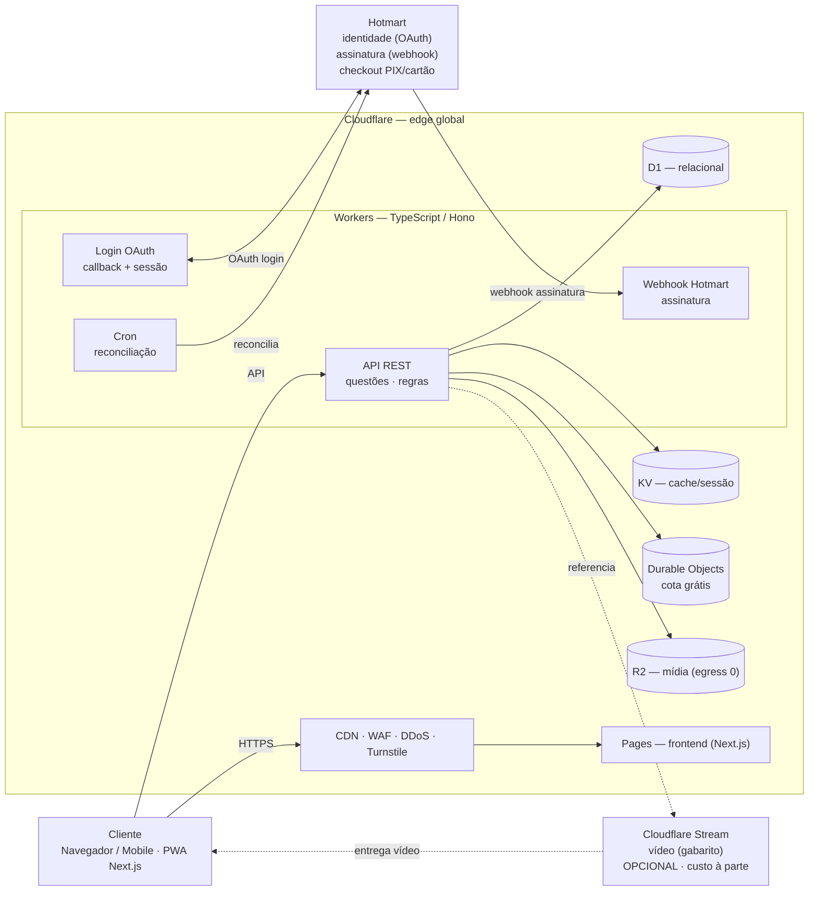
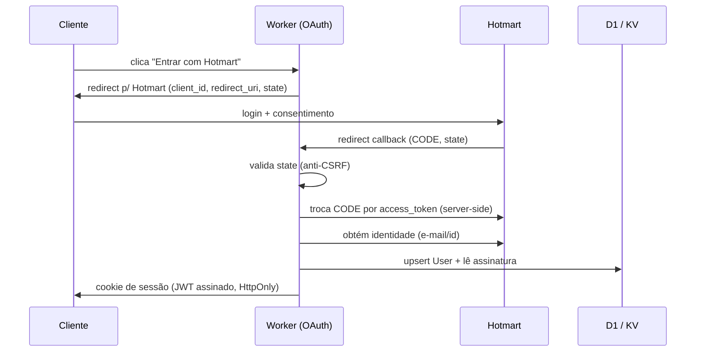
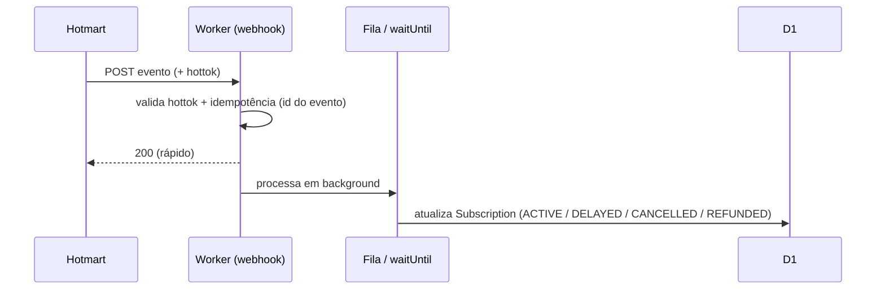
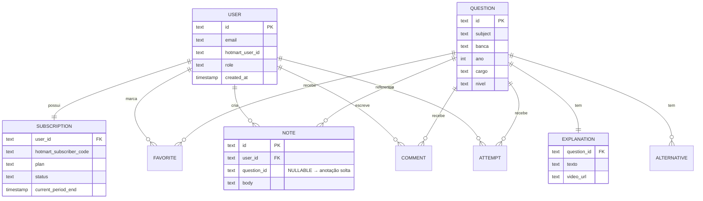

# Mais Aprovação — Especificação Técnica (MVP)

> Documento técnico de referência para construção. Companion da proposta comercial (`proposta-mais-aprovacao.pdf`). Prazo do MVP: **3 meses**. Custos verificados em jun/2026.

---

## 1. Decisões de arquitetura (resumo)

| Camada | Escolha | Porquê |
|---|---|---|
| Compute | **Cloudflare Workers** (TypeScript + **Hono**) | Edge global, escala automática, custo ~zero no volume |
| Frontend | **Cloudflare Pages** (Next.js) | Responsivo, SSR/SEO, banda grátis e ilimitada |
| Banco | **D1** (SQLite serverless) | Relacional, dentro da franquia do Workers Paid |
| Cache / sessão | **KV** | Leitura global <5ms; cache de questões e sessão |
| Estado/cota | **Durable Objects** (1 por usuário) | Contador da cota grátis, single-writer por usuário |
| Mídia | **R2** (egress zero) | Imagens/estáticos sem custo de banda |
| Vídeo | **Cloudflare Stream** *(isolado)* | Streaming adaptativo; **único custo que escala com uso** |
| Identidade | **Hotmart OAuth 2.0** | Login via Hotmart (decisão do projeto) |
| Assinatura | **Hotmart webhook + API** | Cobrança/recorrência fora do app |
| Segurança borda | WAF · DDoS · **Turnstile** | Anti-bot e proteção na borda, nativos |

---

## 2. Diagrama macro

---

## 3. Fluxos da Hotmart

### 3.1 Login (OAuth 2.0 — Authorization Code)

Pontos técnicos: o `state` é obrigatório (anti-CSRF); a troca do `CODE` é **server-side** no Worker (o `client_secret` nunca vai ao browser); a sessão é um **JWT assinado em cookie HttpOnly/Secure/SameSite** (Workers são stateless — sessão no cookie, validada a cada request; o entitlement é relido do D1/KV). O `client_secret` e o segredo de assinatura do JWT ficam em **Workers Secrets**.

### 3.2 Assinatura (webhook / postback)

Eventos tratados: `PURCHASE_APPROVED` (ativa), `PURCHASE_COMPLETE`, `PURCHASE_REFUNDED` / `CHARGEBACK` / `PROTEST` (revoga), `PURCHASE_DELAYED` (graça), `SUBSCRIPTION_CANCELLATION` (revoga ao fim do ciclo), `SWITCH_PLAN`. Requisitos: **validar o hottok** (rejeitar POST sem token correto), **idempotência** (deduplicar por id de transação — a Hotmart reenvia até 5×), responder **2xx rápido** e processar pesado em background, e um **cron de reconciliação** (1×/dia ou no login) que consulta a API e corrige webhooks perdidos.

---

## 4. Modelo de dados (D1)

`UsageQuota` não fica em tabela: vive num **Durable Object por usuário** (contador + janela), que é o mecanismo da cota grátis e do rate-limit. `EXPLANATION.video_url` aponta para o Cloudflare Stream — manter só a URL desacopla o vídeo do resto.

---

## 5. Segurança (checklist)

- **Borda:** WAF + rate-limit + Turnstile (registro/login); somente HTTPS (TLS gerenciado).
- **Sessão:** JWT assinado, cookie HttpOnly/Secure/SameSite=Lax, expiração curta + refresh; `state` anti-CSRF no OAuth.
- **Webhook:** validar **hottok**, idempotência, tratar como superfície pública hostil; nunca conceder papel de admin via webhook.
- **Segredos:** `client_id`/`client_secret` Hotmart, hottok, segredo do JWT em **Workers Secrets** (nunca em código).
- **Autorização:** RBAC (`admin`, `assinante`, `gratuito`) checado **no Worker**, nunca no frontend.
- **Dados:** D1 com migrações versionadas; backups/export periódicos; validação/sanitização de entrada (queries parametrizadas — sem string interpolation).
- **LGPD:** consentimento no cadastro, base legal, rota de exclusão de conta/dados, retenção mínima; dados pessoais do comprador vindos da Hotmart tratados com o mínimo necessário.

---

## 6. Escalabilidade (notas)

Os **Workers escalam horizontalmente sozinhos** (isolates em 300+ PoPs; sem réplicas a gerenciar). O gargalo é sempre a **camada de estado single-writer**:

- **Leitura de questões** (read-heavy) → cache em **KV** ou no edge; tira o grosso do tráfego do D1.
- **Cota grátis** → **Durable Object por usuário** já é sharding natural (cada usuário é uma ilha de escrita).
- **D1** → 1 banco = 1 Durable Object single-threaded, 10 GB/DB. No volume do MVP é folgado; se crescer muito, **sharding** (por tenant/entidade) + read replicas. Limite que morde primeiro: escrita concentrada, não o compute.
- No volume previsto (100 → 1.500 usuários/mês), **nada disso é assunto** — tudo cabe na franquia.

---

## 7. Custos de cloud (vídeo isolado)

Premissas: ~120 questões/usuário/mês → ~1.500 req de API/usuário; frontend estático no Pages (banda grátis). Franquias do **Workers Paid (US$5/mês)**: 10M req + 30M CPU-ms; D1 25 bi linhas lidas / 50M escritas / 5 GB; KV 10M leituras; DO 1M req + 400k GB-s; R2 10 GB + egress zero. Cotação ~R$ 5,15/US$.

### 7.1 Plataforma (SEM vídeo)

| Serviço | 100 usuários | 1.500 usuários | Custo |
|---|---|---|---|
| Workers (req + CPU) | 150k / 1,2M CPU-ms | 2,25M / 18M CPU-ms | dentro da franquia |
| D1 | 1,5M leituras / 15k escritas | 22,5M / 225k | dentro da franquia |
| KV / Durable Objects | mínimo | mínimo | dentro da franquia |
| R2 | 1–2 GB | 5–10 GB | ~$0 (egress 0) |
| **Base Workers Paid** | — | — | **$5 fixo** |
| **Total plataforma** | **~US$ 5 (~R$ 25–40)** | **~US$ 5–8 (~R$ 25–40)** | |

### 7.2 Vídeo (Cloudflare Stream) — à parte

| Item | 100 usuários | 1.500 usuários |
|---|---|---|
| Armazenado ($5 / 1.000 min) | ~1.800 min → $9 | ~6.000 min → $30 |
| Entregue ($1 / 1.000 min) | ~6.000 min → $6 | ~90.000–180.000 min → $90–180 |
| **Subtotal vídeo** | **~US$ 15 (~R$ 100)** | **~US$ 120–210 (~R$ 700–1.130)** |

### 7.3 Conclusão

| Cenário | Sem vídeo | Com vídeo |
|---|---|---|
| Fase inicial (100) | ~R$ 25–40/mês | ~R$ 100/mês |
| Crescimento (1.500) | ~R$ 25–40/mês | ~R$ 700–1.130/mês |

A plataforma custa praticamente só a mensalidade mínima; **o vídeo é o único custo que escala — com minutos assistidos, não com usuários**. Gabarito majoritariamente em texto mantém tudo na casa das dezenas de reais. À parte (não-cloud): **comissão da Hotmart por venda** (% por transação).

---

## 8. Plano de construção — 3 meses

**Mês 1 — Fundação:** projeto Cloudflare (Workers/Pages/D1/R2) + CI/CD (Wrangler); modelo de dados e migrações; **login via Hotmart (OAuth)** com sessão JWT; painel admin enxuto + cadastro de questões e taxonomias; base de segurança (Secrets, RBAC, Turnstile).

**Mês 2 — Núcleo:** responder questões + correção; **cota grátis via Durable Objects**; gabarito comentado (texto + `video_url`/Stream); comentários; anotações (vinculadas e soltas); favoritos; **webhook de assinatura Hotmart** + máquina de estados + cron de reconciliação.

**Mês 3 — Acabamento:** frontend responsivo (mobile-first) + SEO das páginas públicas; painel de progresso/desempenho; testes (unit + e2e dos fluxos críticos: login, cota, webhook); hardening + LGPD; deploy de produção, domínio, observabilidade e ajustes finais.

**Stack de build:** TypeScript, Hono (API), Next.js (Pages), Drizzle ORM (D1), Zod (validação), Wrangler (deploy), Vitest/Playwright (testes).

---

## 9. Fora do escopo / responsabilidade da operação

Produção de conteúdo (cadastro das questões e gravação dos vídeos); custos mensais de infraestrutura (seção 7); comissões e configuração da conta Hotmart (produto/oferta/assinatura); identidade visual definitiva. Inclui-se uma rodada de ajustes por entrega de fase.
