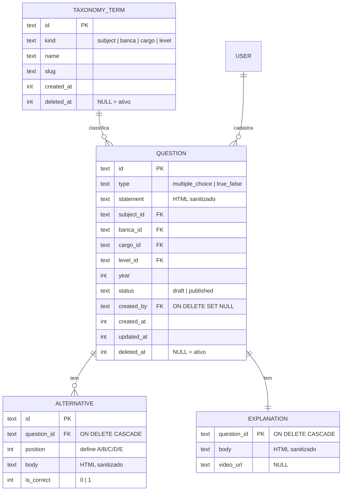

# Admin & Conteúdo — Painel, Questões e Taxonomias (design)

> Sub-projeto 2 de 4 da plataforma **Mais Aprovação Questões**. Companion da
> `docs/especificacao-tecnica.md` e continuação de
> `2026-07-06-fundacao-auth-design.md`. Escopo: **API de administração + o
> primeiro frontend do repositório**.

## Contexto

O sub-projeto 1 (Fundação) está mergeado: autenticação própria, webhook de
compra, cron de reconciliação e cinco tabelas em D1. Backend apenas — o
diretório `web/` ainda está vazio.

A decomposição original previa este sub-projeto como "painel admin enxuto".
Ele cresceu por uma razão declarada: **o painel é a primeira coisa apresentável
da plataforma**, e serve de vitrine do que foi construído até aqui. Em troca do
escopo maior, o design system produzido aqui é o mesmo que o sub-projeto 4
(frontend do aluno) vai consumir — não é gasto antecipado, é gasto deslocado.

Este spec cobre **apenas o sub-projeto 2**.

## Objetivo e critério de sucesso

Um painel administrativo onde a operação cadastra, edita e publica questões, e
a API que o serve. O aluno ainda não tem tela: responder questão é o
sub-projeto 3. O que este entrega ao próximo é **o acervo e o design system**.

**Pronto quando:**

1. Uma pessoa não-técnica cria uma questão dos dois tipos suportados, com
   imagem e gabarito comentado, e publica — sozinha, sem `curl`.
2. O acesso ao painel exige Google ou GitHub com MFA ativo; o método
   *One-time PIN* está bloqueado na política do Access.
3. `npm test` verde nos dois pacotes do repositório e `scripts/audit-osv.mjs`
   sem achados.
4. As quatro telas respondem bem em desktop e em mobile.
5. O design system está em tokens reutilizáveis, prontos para o sub-projeto 4.

## Escopo — quatro telas

| Tela | O que faz |
|---|---|
| **Login** | Reusa `POST /auth/login`, que já existe. Widget do Turnstile entra aqui |
| **Lista de questões** | Tabela paginada, busca por texto, filtro pelas taxonomias |
| **Editor de questão** | Enunciado, alternativas, gabarito comentado (texto + `video_url`), taxonomias, imagens. Salvar rascunho ou publicar |
| **Taxonomias** | CRUD de Assunto, Banca, Cargo e Nível |

Com tema, design system, responsividade, editor rich-text e preview.

**Fora de escopo, explicitamente:** responder questão, cota grátis,
comentários, anotações e favoritos (sub-projeto 3); qualquer tela do aluno
(sub-projeto 4); importação em massa; dashboard e métricas; gestão de usuários;
permissões granulares; edição em massa; histórico de versões.

---

## 1. Modelo de dados

Cinco tabelas novas. Convenções herdadas da Fundação: id em `text`, timestamps
em `integer`, e **toda FK para `users` declara ação de exclusão**.



### Uma tabela para as quatro taxonomias, não quatro

Assunto, banca, cargo e nível têm CRUD idêntico. Quatro tabelas seriam quatro
rotas, quatro telas e quatro conjuntos de teste para o mesmo comportamento.

O preço é real: nada no banco impede `banca_id` apontar para um termo com
`kind='cargo'`. SQLite não faz `CHECK` com subquery, então a invariante vive na
camada de escrita e **num teste que tenta exatamente esse cruzamento**. É esse
teste que torna a escolha aceitável; sem ele, quatro tabelas seriam melhores.

### Certo/errado é `N=2`, não uma tabela separada

Uma questão Cespe grava duas `alternatives`, com corpo "Certo" e "Errado".
Correção, consulta e cascata ficam idênticas para os dois tipos; só a
renderização diverge. A invariante — **exatamente uma alternativa com
`is_correct=1`** — é validada na escrita, com teste para os dois tipos.

Em `multiple_choice` o número de alternativas é **variável**, não fixo em cinco:
bancas usam 4 ou 5, e o editor permite adicionar e remover. `position` define
as letras exibidas (A, B, C…). Em `true_false` as duas alternativas são criadas
pelo editor com rótulos fixos, sem edição de corpo.

Isso resolve uma contradição do `docs/demo.html`, que mostra alternativas A–E
tendo Cespe/Cebraspe como banca de exemplo — justamente a banca conhecida por
usar certo/errado.

### Assunto tem um nível só

Considerou-se declarar `parent_id` desde a primeira migração, pelo mesmo
argumento que a Fundação usou para as cascatas. **O argumento não se aplica:**
mudar ação de FK em SQLite exige recriar a tabela, mas adicionar uma coluna
nullable depois é um `ALTER TABLE ADD COLUMN`. Sem custo em adiar, então adia-se.

### Soft delete em questões e taxonomias

`deleted_at integer NULL` nas duas tabelas.

Para **taxonomias**, o motivo é imediato: apagar a banca "Cespe" com 500
questões apontando para ela ou quebra a FK ou apaga a banca das questões
antigas silenciosamente. Com soft delete, o termo some da lista de escolha e as
questões já cadastradas continuam exibindo "Cespe".

Para **questões**, o motivo mais forte ainda nem existe no código: o
sub-projeto 3 terá `attempts`, `comments`, `notes` e `favorites`, todos
apontando para `question_id`. Um hard delete leva junto o histórico de
desempenho de todos os alunos que responderam aquela questão.

Três consequências:

- **`UNIQUE(kind, slug)` vira índice parcial** — `WHERE deleted_at IS NULL`.
  Sem isso, apagar "Cespe" e recriá-la colide com a linha morta.
- **O risco clássico do soft delete é esquecer o filtro** e vazar registro
  apagado numa listagem. Nenhuma rota monta query direto: tudo passa por
  `db/questions.ts` e `db/taxonomy.ts`, no padrão que a Fundação já usa em
  `db/users.ts`. O filtro mora num lugar só.
- **As imagens no R2 ficam.** Se a questão pode voltar, a imagem dela também.

### Edição é livre e o id nunca muda

Questão publicada pode ser editada normalmente. A alternativa considerada —
congelar após publicar, restando só apagar e recadastrar — foi rejeitada:

- Com soft delete, "apagar e recriar" cria uma questão **com id novo**. As
  `attempts` do sub-projeto 3 continuam apontando para o id velho: quem
  respondeu perde o vínculo e a estatística da questão zera. Comentários e
  anotações ficam órfãos numa questão invisível.
- Um **gabarito errado** — o defeito mais grave e mais comum de um banco de
  questões — passaria a exigir recriação em vez de uma correção de segundos.
- A regra não elimina a edição, só a encarece: na prática a operação
  despublica, edita e republica. Mesmo resultado, mais passos.

O que a objeção acerta: mudar o gabarito de uma questão que muitos alunos já
responderam altera o significado das respostas passadas. **Isso é uma decisão
explicitamente adiada para o sub-projeto 3**, que é quem tem a tabela
`attempts` — recalcular ou invalidar as tentativas afetadas.

---

## 2. Arquitetura

### Backend — rotas

```
POST   /admin/media                    upload avulso → { url }
GET    /admin/questions                lista paginada, filtros, busca
POST   /admin/questions                cria a questão inteira, num envio só
GET    /admin/questions/:id
PATCH  /admin/questions/:id            edita (botão Salvar, sem disparo automático)
POST   /admin/questions/:id/publish  ·  /unpublish
DELETE /admin/questions/:id            soft delete

GET|POST   /admin/taxonomy
PATCH|DELETE /admin/taxonomy/:id       DELETE é soft
```

**Cadastro em um step, sem autosave e sem rascunho vazio.** Uma versão anterior
deste design criava um rascunho vazio ao abrir o editor, para ter um
`question_id` antes do primeiro upload de imagem — o que trazia autosave junto,
e com ele a necessidade de limpar rascunhos abandonados.

**Esse requisito morreu com a decisão de soft delete.** O prefixo
`questions/{id}/` no R2 existia para que apagar a questão apagasse suas imagens
junto; como questão não é mais apagada de verdade, as imagens nunca seriam
removidas de qualquer forma. A chave é plana — `media/{uuid}.{ext}` — e o
upload não precisa saber de questão nenhuma.

Efeito colateral aceito: uma imagem enviada num cadastro abandonado fica no R2
sem referência. Para um painel de 1–2 pessoas atrás de MFA, é lixo mais barato
que a máquina de estados que o evitaria.

`status` continua existindo, mas agora é escolha explícita de quem cadastra
("Salvar rascunho" ou "Publicar"), não um estado que a máquina inventa.

### Frontend — Next.js com export estático

Next.js em `web/`, App Router, Tailwind v4, TipTap mínimo. Deploy no Pages.

**`output: 'export'`.** Um painel atrás de Access não tem SEO nem visitante
anônimo, então SSR não serve ali — e sem SSR não é preciso o adaptador
`@opennextjs/cloudflare` nem a árvore que ele traz. O painel é uma SPA que
conversa com o Worker. O sub-projeto 4, que precisa de SSR de verdade, decide
por conta própria; o que ele herda daqui é o design system, não o modo de build.

### Um mesmo hostname para painel e API

O arranjo óbvio — painel em `admin.<domínio>`, API em `api.<domínio>` — está
errado: o Access autentica setando um cookie no domínio da aplicação, e um
`fetch` cross-origin não o carrega. O painel autenticaria e a API rejeitaria
toda chamada.

```
admin.<domínio>/*      → Pages (painel)
admin.<domínio>/api/*  → Worker (rotas /admin/*)
```

Uma única aplicação Access cobre os dois, o cookie funciona e o CORS deixa de
existir como problema. O Worker continua servindo `/auth/*` e
`/webhooks/hotmart` no hostname público, **fora do Access** — a Hotmart precisa
alcançar o webhook sem passar por identidade.

> **A confirmar no runbook:** o mapeamento exato de Worker Routes por path
> convivendo com uma aplicação Access no mesmo hostname.

---

## 3. Segurança

### 2FA no acesso admin — Cloudflare Access

O painel e as rotas `/admin/*` ficam atrás do Zero Trust. O Access autentica na
borda e injeta o header `Cf-Access-Jwt-Assertion`; o Worker valida:

- Chaves públicas em `https://<team>.cloudflareaccess.com/cdn-cgi/access/certs`,
  rotacionadas a cada 6 semanas — casa-se pelo `kid`, **nunca chave hardcoded**.
- Claims verificados: `iss` (o domínio do time), `aud` (a tag única da
  aplicação) e `email`.

São ~20 linhas com `jose`, que já está no `package.json` fazendo o JWT de
sessão. **Zero pacote novo.**

**O IdP precisa ser Google ou GitHub, com MFA ativo na conta.** Um dos métodos
de login do Access é *One-time PIN* por email — e a própria documentação avisa
que uma política baseada nele é perigosamente permissiva. O raciocínio é o
mesmo que descartou "código de 6 dígitos por email" como segundo fator: o link
mágico da Fundação já concede acesso total via email, então um segundo fator
que também chega por email não adiciona fator, só fricção.

**Consequência que precisa estar escrita:** se a política do Access for
configurada permitindo OTP, o 2FA evapora silenciosamente, sem erro nenhum.
Isso é dependência operacional, não código (ver seção 6).

**O furo que anularia tudo:** hoje um admin pode entrar por
`POST /auth/recover` → link mágico → nova senha. Enquanto esse caminho estiver
aberto, o segundo fator vale zero para quem controla o email. Como o painel
inteiro fica atrás do Access, o recover deixa de ser um caminho de entrada no
`/admin/*` — mas continua válido para o app do aluno, e é assim que deve ser.

### Desenvolvimento local

Em `wrangler dev` e `next dev` nada passa pela borda da Cloudflare, então o
header `Cf-Access-Jwt-Assertion` não existe.

| | Produção | Local |
|---|---|---|
| Passa pelo Access? | sim | **não** |
| Login + senha + Turnstile | vale | vale |
| RBAC `role=admin` no D1 | vale | vale |

O painel **não fica aberto** em dev — login, senha e `role=admin` continuam
valendo. O que falta localmente é a segunda camada: em dev há um fator, em
produção há dois.

O middleware pula a validação apenas quando uma var presente só em `.dev.vars`
está setada. **Fail-closed:** ausência da var significa exigir o JWT. Um teste
trava a invariante — é o mesmo padrão de disciplina já aplicado ao
`HOTMART_HOTTOK`.

Os *service tokens* do Access não resolvem isso: também são validados só na
borda.

### Sanitização de HTML sem dependência nova

O TipTap produz HTML no browser, e nada impede alguém de mandar `<script>`
direto na API — o editor é só uma sugestão para clientes bem-comportados.
Sanitiza-se **no servidor, na escrita**, com allowlist de tags e atributos.

O caminho normal seria DOMPurify, que precisa de DOM e no Worker significa
arrastar `jsdom`. Em vez disso: **Workers tem `HTMLRewriter` nativo** — parser
de HTML em streaming, na plataforma, zero pacotes. Allowlist passa, o resto é
descartado. É a mesma escolha que produziu PBKDF2 via WebCrypto em vez de
bcrypt.

### Upload para o R2

Quatro regras:

1. Tamanho máximo.
2. Tipo verificado pelos **magic bytes**, não pelo `Content-Type` declarado.
3. Nome gerado por nós — o nome do arquivo do usuário nunca toca o storage, é
   vetor de path traversal.
4. Servido de um hostname **sem cookies**, para que um SVG malicioso não execute
   com a sessão do admin.

### Duas camadas independentes

Access na borda (identidade + MFA) e `role=admin` lido do D1 no Worker
(autorização). Nenhuma confia na outra. O `middleware/rbac.ts` já existe e não
muda.

**Isso significa dois logins, e é deliberado.** O admin autentica no Google ou
GitHub (Access, na borda) e depois com email e senha no painel (sessão da
aplicação). Passar pelo Access **não** cria sessão no app: o email do JWT do
Access não é usado para identificar o usuário no D1 — se fosse, o Access
viraria fonte de identidade da aplicação e as duas camadas deixariam de ser
independentes. Um email autenticado pelo Access sem `role=admin` correspondente
no D1 recebe 403.

### Turnstile

O widget entra agora, na tela de login. A metade server-side
(`src/lib/turnstile.ts`) já existe desde a Fundação e está sem par.

---

## 4. Supply chain

Política registrada em `~/.claude/CLAUDE.md` §5, valendo para todos os
projetos. O que ela impõe aqui:

- **Nenhum pacote novo sem aprovação explícita**, com justificativa: o que faz,
  quantos transitivos arrasta, por que não dá para resolver sem.
- **Cooldown de 14 dias** — nunca instalar versão publicada há menos disso.
- **`ignore-scripts=true`** global (já aplicado em `~/.npmrc`). Pacotes que
  compilam legitimamente exigem `npm rebuild <pkg>` explícito.
- **`npm ci`**, nunca `npm install`, salvo quando a intenção é mudar deps.

### As medições que decidiram a stack

Feitas via `npm install --package-lock-only`, sem baixar nada:

| | Pacotes |
|---|---|
| Backend hoje — runtime | **4** (hono, drizzle-orm, jose, zod) |
| Backend hoje — total com devDeps | 97 |
| `next` + `react` + `react-dom` | **52** |
| `vite` + `react` + `react-dom` + plugin | 50 |
| `tailwindcss` v4 | **1** |
| TipTap com `starter-kit` | 57 |
| TipTap mínimo (`core` + `pm` + `react`) | **33** |
| Lexical | 38 |
| `marked` + `dompurify` | 3 |

**Next.js versus Vite é empate — 52 contra 50.** Supply chain sai da mesa como
critério de escolha de framework, e a decisão volta ao mérito: Next.js é o que
a spec já definiu e o que o sub-projeto 4 vai usar.

**O único item que dobra a superfície do frontend é o editor.** Escolhido o
TipTap mínimo (33) sobre o starter-kit (57): WYSIWYG de verdade importa porque
quem digita é a operação, não um desenvolvedor, e prova de concurso tem tabela.

### Achados da auditoria

`scripts/audit-osv.mjs` (zero dependências, `fetch` nativo, API pública da
OSV.dev) contra os 103 pacotes instalados. Três achados, **todos
devDependency transitiva**, todos já corrigidos por `overrides`:

| Pacote | Vem de | Problema | Corrigido em |
|---|---|---|---|
| `postcss@8.5.16` | `vitest → vite` | Path traversal no auto-load de source map | 8.5.20 |
| `sharp@0.34.5` | `vitest-pool-workers → miniflare` | 4 CVEs herdados do libvips | 0.35.3 |
| `esbuild@0.18.20` | `drizzle-kit → @esbuild-kit/esm-loader → core-utils` | dev server aceita requisição de qualquer origem e devolve a resposta | 0.25.12 |

Exposição prática ≈ zero — exigiriam, respectivamente, CSS malicioso passando
pelo postcss, imagem maliciosa entrando no libvips e o dev server do esbuild
exposto (que não usamos). Mas os três ficam na máquina de desenvolvimento.

**A política mudou a resposta em dois pontos.** O reflexo para o postcss seria
pegar `8.5.25`, publicada há 4 dias — reprovada no cooldown; o alvo é `8.5.20`,
com 14 dias. E o esbuild exigiu **override escopado**
(`"@esbuild-kit/core-utils": { "esbuild": "0.25.12" }`) em vez de global: o
esbuild do topo já estava em 0.28.1, e um override global o rebaixaria. Só a
cópia aninhada estava vulnerável, porque `@esbuild-kit/core-utils` — pacote
deprecated, sucedido pelo `tsx` — fixa `~0.18.20`.

Postcss e sharp são as mesmas vulnerabilidades que o Next.js arrasta, então
esses dois overrides se repetem no `package.json` do `web/`.

**Um bug encontrado no próprio auditor, que vale como lição de método:** a
primeira versão do `collect()` não descia em `node_modules` aninhados e por
isso deu "nenhuma vulnerabilidade" com o esbuild vulnerável instalado. É
exatamente ali que o npm guarda a cópia divergente quando duas dependências
pedem versões incompatíveis — e portanto exatamente onde uma versão vulnerável
se esconde enquanto a do topo aparece limpa. Corrigido; a contagem subiu de 98
para 103 pacotes.

**`npm audit` não é evidência de segurança aqui.** Ele compara versões contra
CVEs publicados; um pacote comprometido ontem não tem CVE, tem malware. Contra
isso valem o cooldown e o `ignore-scripts`, não o `audit`.

---

## 5. Testes

Vitest sobre Miniflare e D1 local, com rede mockada — herdado da Fundação.

**Invariantes com teste dedicado.** São as que o banco não impõe sozinho:

- Exatamente uma alternativa com `is_correct=1`, nos dois tipos de questão.
- `banca_id` recusa um termo com `kind='cargo'` — é o preço da tabela única de
  taxonomias, e é o teste que a torna aceitável.
- Listagem nunca devolve registro com `deleted_at` preenchido, em questões e em
  taxonomias.
- Apagar e recriar um termo com o mesmo slug funciona — o índice parcial.
- Sem `Cf-Access-Jwt-Assertion` e sem a var de bypass, `/admin/*` responde 401.
- A var de bypass não existe na configuração de produção.
- `role=user` autenticado recebe 403 em `/admin/*`, mesmo passando pelo Access.
- Sanitização: `<script>`, `onerror=`, `javascript:` em href e SVG com script
  não sobrevivem ao `HTMLRewriter`.
- Upload rejeita arquivo cujos magic bytes não batem com o tipo declarado.

**Frontend — o ponto fraco honesto deste sub-projeto.** Playwright é o que a
spec prevê, mas e2e contra um painel atrás de Access exige service token e
configuração que ainda não existe. O e2e cobre só o caminho crítico (login →
criar questão → publicar → aparece na lista), rodando contra o bypass de
desenvolvimento. Cobertura visual e do editor fica em inspeção manual.

---

## 6. Dependências operacionais

Não são código, e bloqueiam as tarefas correspondentes:

| Dependência | Bloqueia |
|---|---|
| Criar a aplicação **Cloudflare Access**, com IdP Google ou GitHub e **método OTP bloqueado** na política | todo o acesso ao painel |
| Obter a **tag `aud`** da aplicação e o **team domain** | validação do JWT no Worker |
| **Bucket R2** e hostname público sem cookies para servi-lo | upload de imagens |
| Hostname `admin.<domínio>` com **Worker Route** em `/api/*` | painel e API no mesmo domínio |
| Confirmar o **limite de seats** do plano grátis do Zero Trust | dimensionamento de custo |

Herdadas e ainda abertas do sub-projeto 1: rodar
`docs/runbook-verificacao-hotmart.md` contra o sandbox — o caminho da API de
dados e o `HOTMART_TOKEN_URL` seguem **não confirmados**.

---

## 7. Riscos

| Risco | Impacto | Mitigação |
|---|---|---|
| **Política do Access mal configurada** (permitindo OTP) | o 2FA evapora sem erro visível | está na tabela da seção 6 e no critério de pronto nº 2; verificação manual, porque nenhum teste automatizado alcança a configuração do dashboard |
| **Escopo do painel cresceu** (tema, design system, rich-text, upload) | comprime o sub-projeto 3 | o design system é consumido pelo sub-projeto 4 — gasto deslocado, não adicional. Se apertar, o corte é o preview da questão, não a sanitização |
| **Primeiro frontend do repositório** | não há padrão estabelecido para seguir | export estático elimina o adaptador Cloudflare e a maior fonte de configuração |
| **Cross-origin e cookie do Access** | painel autentica e API rejeita tudo | resolvido por design (mesmo hostname); o mapeamento de rotas entra no runbook |
| **Tabela única de taxonomias** | `banca_id` apontando para termo de outro `kind` | validação na escrita + teste dedicado ao cruzamento |
| **e2e fraco no frontend** | regressão visual passa despercebida | aceito conscientemente; caminho crítico coberto, resto em inspeção manual |
